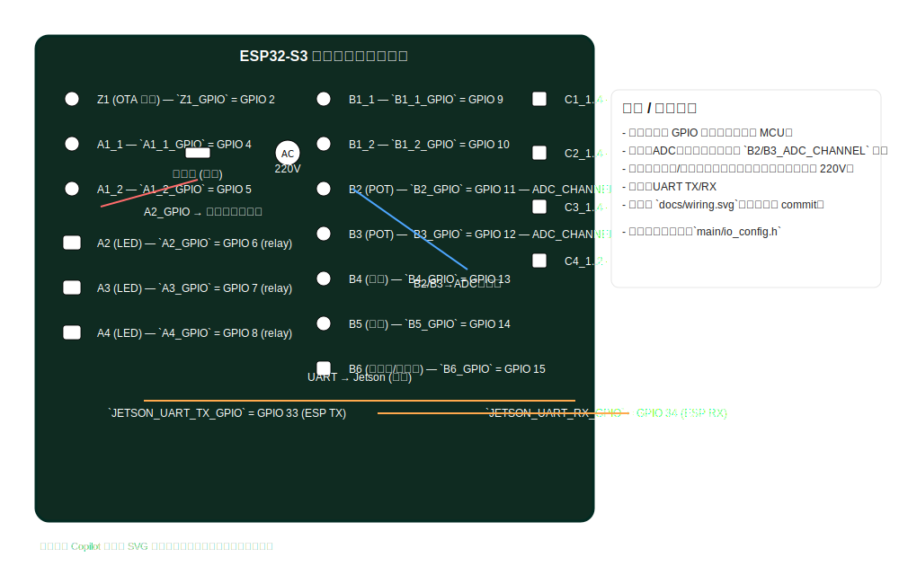

# ESP-S3 控制器
ESP32-S3-WROOM-1U https://documentation.espressif.com/esp32-s3-wroom-1_wroom-1u_datasheet_cn.pdf
基於ESP32-S3開發版，連結到電控箱表面的相關輸入與輸出元件，後續會再連結到另外一塊伺服控制器專用的ESP32-S3開發版，以及主要負責影像辨識及開啟Web_Server遠端控制的大腦Jetson Orin nano Devkit。
此S3控制器相關輸入輸出如下
| 主項目     | 元件           | 元件編號 | 輸入/輸出 | 數量 | GPIO | VCC | GND |  備註 |
|------------|----------------|-----------|-----------|------|------|------|-----|------|
|OTA|更新韌體按鈕|Z1|輸入|1|1|V|V|用來遠端更新|
| 電源端     | 三檔位開關     | A1 | 輸入      | 1    |   2   |    X  |  V   |   切換模式，自動/手動/搖桿操作   |
| 電源端     | 狀態指示燈     | A2 | 輸出      | 1    |   1   |   X   |   X  |   220V,自動模式，黃色   |
| 電源端     | 狀態指示燈     | A3 | 輸出      | 1    |   1   |   X   |   X  |   220V ,手動模式 ，藍色 |
| 電源端     | 狀態指示燈     | A4 | 輸出      | 1    |   1   |   X   |   X  |   220V,搖桿操作  ，綠色 |
| 選擇端 | 三檔位開關     | B1 | 輸入      | 1    |   2   |   X   |  V   |   切換槽位選擇項目為縱軸/橫軸/高度   |
| 選擇端 | 電位器         | B2 | 輸入      | 1    |   1   |   V   |  V   |   選擇試體   |
| 選擇端 | 電位器         | B3 | 輸入      | 1    |   1   |   V   |  V   |   選擇槽位   |
| 選擇端 | 切換開關       | B4 | 輸入      | 1    |   1   |   X   |  V  |   執行選擇「試體/槽位」   |
| 選擇端 | 點動開關       | B5 | 輸入      | 1    |   1   |   X   |  V   |  確認    |
| 選擇端 | 蜂鳴器         | B6 | 輸出      | 1    |   1   |   X   |  V   |  220V，報警    |
| 搖桿端     | 雙軸搖桿       | C1 | 輸入      | 1    |   4   |   X   |  V   |   X/Y|
| 搖桿端     | 雙軸搖桿       | C2 | 輸入      | 1    |   4   |   X   |  V   |   大小手臂|
| 搖桿端     | 雙軸搖桿       | C3 | 輸入      | 1    |   4   |   X   |  V   |   肩膀/手腕旋轉|
| 搖桿端     | 單軸搖桿       | C4 | 輸入      | 1    |   2   |   X   |  V   |    手掌夾取  |


## 使用方法
根據需要及元件編號，輸入對應的GPIO腳位，設定對應的輸入為上拉電阻
EX:
元件A2 需要一個GPIO  則 A1_1 = 10
元件C1 需要四個GPIO腳位 則C1_1 = 11; C1_2 = 12; C1_3 = 13; C1_4 = 14;
其他元件依照元件編號及使用的GPIO數量，以此類推。


## 程式介紹
主要分成三部分，電源端/選擇端/搖桿端，且具有Web_Server功能，會把各端狀態數值顯示在頁面上，同時該頁面還有按鈕可以控制是否要執行OTA功能，在顯示資料到頁面上的同時把資料輸出給Jetson Orin Nano。

電源端：
根據使用者輸入的腳位來設定跟元件的腳位，電源端根據三檔位開關(A1)的狀態來設定狀態指示燈(A2~A4)哪個燈要輸出高電位，A1_1對應到A3，A1_2對應到A4，其中三檔位開關的A1_1及A1_2不會同時接收到高電位訊號，所以兩個都是高電位的話(因為上拉電阻)，則A2輸出高電位。

選擇端：
於電源端的A3啟用時才作用，且會根據Jetson Orin Nano得到4種範圍值，一個是用來選擇目標物件(試體)，另外三個對應到橫軸/縱軸/高度軸的範圍
會根據輸入儲存及輸出變數，切換開關B4不作用時讀取B2電位器，切換開關B4作用時讀取B3電位器，三檔位開關B1用來切換讀取B3電位器時，要存放到哪個變數資料(縱軸/橫軸/高度)，點動開關觸發則送出資料給Jetson Orin Nano。

搖桿端：
讀取並儲存搖桿狀態並輸出給Jetson Orin Nano
每軸搖桿對應到個兩個方向資料，而雙軸搖桿有兩個軸，對應到4個方向資料，C1_1/C1_2為一組，C1_3/C1_4為一組，以此類推，且每個軸的兩個方向資料不會同時被觸發


# Container連結到USB
參考https://blog.csdn.net/laoxue123456/article/details/138339029
因為Docker無法直接訪問主機的USB設備需要使用USBIP，這是允許我們通過網路共享USB設備的工具，以下教學
分成三部分：
主機端下載安裝usbipd-win，以及在wsl安裝ubuntu(因為docker-desktop無法編譯)，並且在ubuntu安裝usbip工具
管理員執行powershell
```powershell
usbipd list
```
這會顯示主機端所有usb設備，找到你要連接的設備的busid，然後執行
```powershell
usbipd bind --busid <busid>
```
接著在wsl的ubuntu安裝usbip工具		
```bash
apt install linux-tools-virtual hwdata
update-alternatives --install /usr/bin/usbip usbip `ls /usr/lib/linux-tools/*/usbip |tail -n1` 20 
```
使用usbip help測試是否成功
```bash
usbip help
```		

接著在wsl啟動usbipd-win服務
```powershell
usbipd wsl list
usbipd wsl attach --busid <busid> --auto-attach
```
然後在ubuntu查看usb裝置
```bash
dmesg | tail
```


# ESP-S3 Controller — 專案說明 (美化版)

本專案基於 ESP32-S3 開發板，負責連接並讀取電控箱表面各類輸入（開關、電位器、搖桿）以及控制輸出（指示燈、蜂鳴器等），並提供 Web API 與 UART 與上層主控 (Jetson Orin Nano) 溝通，支援 OTA 更新功能。

**主要功能**
- 讀取電源端開關並控制狀態指示燈
- 選擇端：讀取電位器/開關並可將資料傳送給 Jetson
- 搖桿端：讀取多組搖桿輸入並輸出狀態
- Web API：`/status` (回傳 JSON)、`/ota` (觸發 OTA)
- UART：以 JSON 串流同步傳送狀態給 Jetson

**專案結構（重要檔案）**
- `CMakeLists.txt` — 專案根 CMake 設定
- `main/CMakeLists.txt` — main component 設定
- `main/main.c` — 主程式（已整合 IO、UART、HTTP、OTA）
- `main/io_config.h` — 所有 GPIO 與 UART 腳位定義（請依實際接線調整）
- `README.md` — 本文件

**GPIO 與元件對照（示意）**
> 以下 GPIO 皆為範例預設，請以 `main/io_config.h` 為準並依實際接線修改。

| 分類   | 元件 | 編號 | 類型 | GPIO (範例) | 備註 |
|--------|------|------|------:|-----------:|------|
| OTA    | 更新按鈕 | Z1 | 輸入 | `Z1_GPIO` (預設 2) | 觸發 OTA 請使用 Web/API 或長按按鈕 |
| 電源端 | 三檔位開關 | A1 | 輸入 x2 | `A1_1_GPIO`, `A1_2_GPIO` (預設 4,5) | 三種模式自動/手動/搖桿 |
| 電源端 | 指示燈 | A2/A3/A4 | 輸出 | `A2_GPIO` `A3_GPIO` `A4_GPIO` | 表示不同電源模式 |
| 選擇端 | 三檔位開關 | B1 | 輸入 x2 | `B1_1_GPIO`/`B1_2_GPIO` | 選擇儲存變數目標 |
| 選擇端 | 電位器 | B2/B3 | ADC 輸入 | `B2_GPIO` `B3_GPIO` (預設 11/12) | 請對應 ADC channel，程式內為 placeholder |
| 選擇端 | 切換/點動開關 | B4 / B5 | 輸入 | `B4_GPIO` `B5_GPIO` | B5 為確認按鈕（送出） |
| 選擇端 | 蜂鳴器 | B6 | 輸出 | `B6_GPIO` | 若為高電壓 (e.g., 220V) 請透過繼電器驅動 |
| 搖桿端 | C1/C2/C3 (雙軸) | C?_1..C?_4 | 輸入 | `C1_1`..`C3_4` | 每顆雙軸使用 4 路數位方向或 ADC；請依硬體調整 |
| 搖桿端 | C4 (單軸) | C4_1/C4_2 | 輸入 | `C4_1_GPIO` `C4_2_GPIO` | 單軸方向 |

**重要注意事項（硬體）**
- 電位器 (`B2`/`B3`) 為模擬量，請勿啟用上拉或下拉（程式已將它們設為無上下拉的輸入），如欲讀取真實電位器請改用 ADC API（`adc1_get_raw`）。
- 若驅動 220V 或高電壓負載（指示燈/蜂鳴器），務必使用繼電器或光耦隔離，並注意安全與接地。

**快速啟動（在 Dev Container 內）**
1. 開啟專案根資料夾 (`/workspaces/Esp32-S3_Controller`)，並使用 VS Code 的 Dev Container 或在容器內開啟終端。
2. 若容器未自動載入 ESP-IDF 環境，執行：
```bash
source /opt/esp/idf/export.sh
```
3. 設定 target 並建置：
```bash
idf.py set-target esp32s3
idf.py build
```
4. 燒錄並監控（請改為你的序列埠）：
```bash
idf.py -p /dev/ttyUSB0 flash monitor
```


**Web API**
- `GET /status` — 回傳目前所有輸入/輸出狀態的 JSON（同時會將 JSON 透過 UART 傳給 Jetson）。
- `POST /ota` — 啟動 OTA 更新，可透過 body JSON `{ "url": "https://.../firmware.bin" }` 或 query `?url=`。

**開發 / 編譯注意**
- `main/CMakeLists.txt` 已列出所需 IDF component（HTTP server/client、HTTPS OTA、ADC、driver 等），編譯時會自動連結。若增加新依賴請同步更新 `REQUIRES` 或 `PRIV_REQUIRES`。
- `main/io_config.h` 為腳位定義的單一來源，開發時請在該檔修改腳位，而非直接改 `main.c`。

**安全與測試建議**
- 在接線與第一次上電前，先在軟體上把所有輸出設為低，確保繼電器/高電壓裝置不會誤動作。
- OTA 測試時使用 HTTPS 與驗證憑證，範例程式為方便測試已使用簡化流程，實務請補上憑證檢查。

**版本控制與貢獻**
- 如果你要把整個專案（含 `.devcontainer`、Dockerfile）上傳至 GitHub，請在 repo 根管理；若只想同步應用程式，可單獨在 `template-app` 或 `main` 建立 repo。

---

## 接線示意圖（SVG 範例）
下面以 SVG 圖示呈現接線範例。此圖為示意，請以 `main/io_config.h` 的實際設定為準；若要更精細的接線圖（含繼電器/電源），請回覆我想要的細節。

範例 SVG（置於 `docs/wiring.svg`）：



簡化對照表（由 `main/io_config.h` 自動對照，請以該檔為最終準則）：

```
ESP32-S3 GPIO mapping (與 main/io_config.h 一致)

	OTA Z1      -> `Z1_GPIO`  = GPIO 0 (板上 BOOT 按鈕，測試用)
	A1_1        -> `A1_1_GPIO` = GPIO 4
	A1_2        -> `A1_2_GPIO` = GPIO 5
	A2 (LED)    -> `A2_GPIO`   = GPIO 6
	A3 (LED)    -> `A3_GPIO`   = GPIO 7
	A4 (LED)    -> `A4_GPIO`   = GPIO 15

	B1_1        -> `B1_1_GPIO` = GPIO 16
	B1_2        -> `B1_2_GPIO` = GPIO 17

	B2 (POT)    -> `B2_GPIO`   = GPIO 1  (ADC_CHANNEL_0)
	B3 (POT)    -> `B3_GPIO`   = GPIO 2  (ADC_CHANNEL_1)
	B4 (切換)   -> `B4_GPIO`   = GPIO 8
	B5 (點動)   -> `B5_GPIO`   = GPIO 9
	B6 (蜂鳴器) -> `B6_GPIO`   = GPIO 10

	C1_1..C1_4  -> `C1_1_GPIO`..`C1_4_GPIO` = GPIO 11,12,13,14
	C2_1..C2_4  -> `C2_1_GPIO`..`C2_4_GPIO` = GPIO 38,39,40,41
	C3_1..C3_4  -> `C3_1_GPIO`..`C3_4_GPIO` = GPIO 42,21,3,18
	C4_1..C4_2  -> `C4_1_GPIO`,`C4_2_GPIO`   = GPIO 48,45

	JETSON UART TX/RX -> `JETSON_UART_TX_PIN` / `JETSON_UART_RX_PIN` = GPIO 46 / 47

注意：
- B2/B3 為 ADC 輸入（`B2_ADC_CHANNEL` / `B3_ADC_CHANNEL`），程式使用 `esp_adc/adc_oneshot` 讀取。
- `C3_3_GPIO` = 35 在某些模組（含 PSRAM）或特定板型上可能不可用，接線前請確認模組腳位。
- `C4_2_GPIO` = 45 為 strap pin，開機時請避免將其拉低。
```
